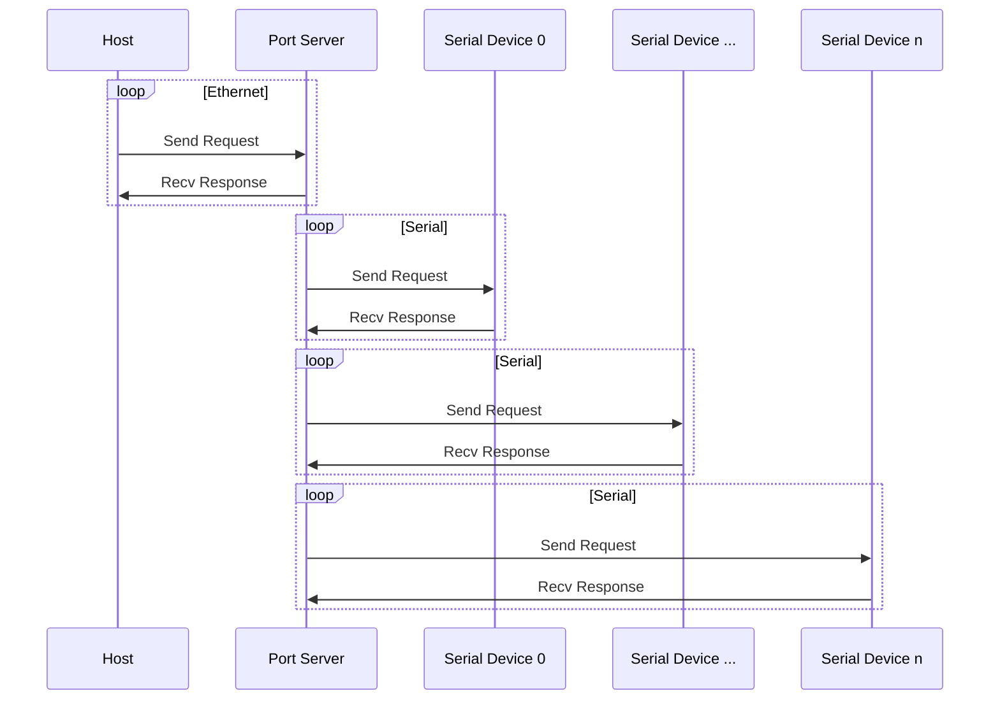
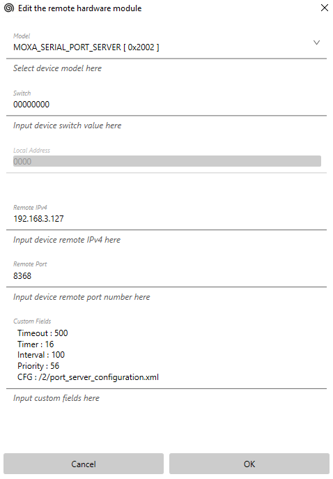
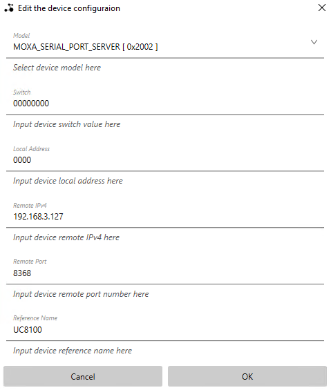
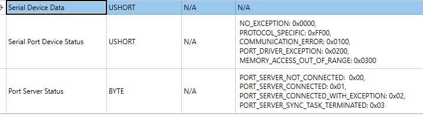
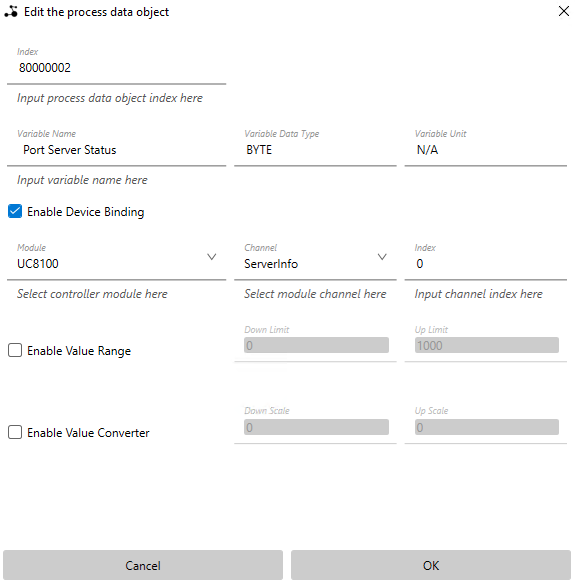
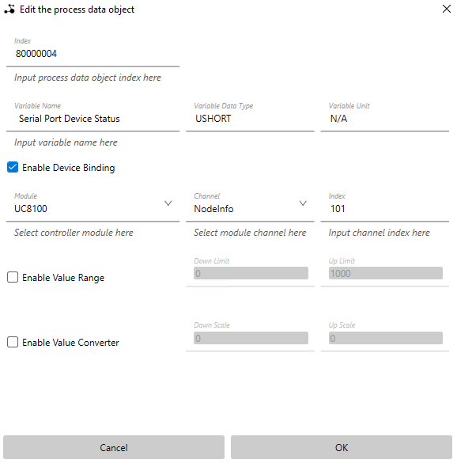
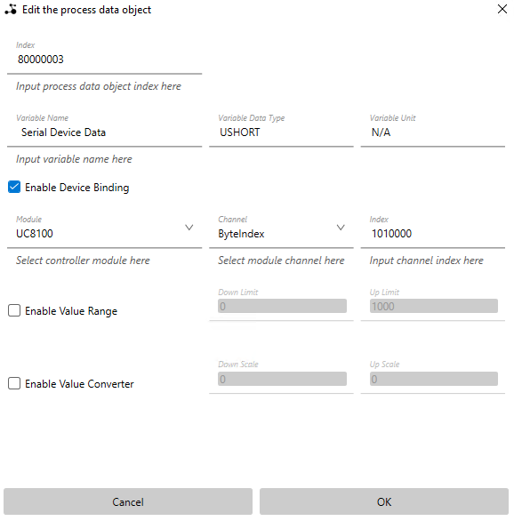

# Serial Port Server

A MOXA embedded computer based serial UART port device server (hereinafter called port server).

## Table of contents

- [License](#license)
- [Mechanism](#mechanism)

- [Usage](#usage)

  - [Configuration](#configuration)
    - [Server Configuration](#server-configuration)
    - [Serial Port Configuration](#serial-port-configuration)
    - [Serial Device Configuration](#serial-device-configuration)

  - [Access Server](#access-server)
    -  [via Socket](#via-socket)
    -  [via Orbment PLC Runtime](#via-orbment-plc-runtime)
    -  [via Generic PLC](#via-generic-plc)

- [Appendix](#appendix)

  - [Available Serial Device Protocols](#available-serial-device-protocols)


## License

TBD


## Mechanism




## Usage

### Configuration

The configurations consists of "Server Configuration", "Serial Port Configuration" and "Serial Device Configuration". All these configurations can be written into a single xml file as child nodes of xml node "SerialPortServer".

```xml
<?xml version="1.0" encoding="utf-8"?>
<SerialPortServer>
	<EthernetServer>
		<IP>192.168.3.127</IP>
		<Port>8368</Port>
		<Protocol>SDE</Protocol>
		<Concurrent>4</Concurrent>
		<WorkPriority>10</WorkPriority>
		<ListenPriority>10</ListenPriority>
		<RecvTimeout>60000</RecvTimeout>
		<SendTimeout>100</SendTimeout>
	</EthernetServer>
	<SerialPorts>
		<Port>
			<ID>0</ID>
			<Prefix>ttyM</Prefix>
			<Mode>UART_RS485_2W</Mode>
			<BaudRate>19200</BaudRate>
			<DataBits>8</DataBits>
			<StopBits>1</StopBits>
			<Parity>EVEN</Parity>
			<Priority>10</Priority>
		</Port>
		<Port>
			<ID>1</ID>
			<Prefix>ttyM</Prefix>
			<Mode>UART_RS485_2W</Mode>
			<BaudRate>9600</BaudRate>
			<DataBits>8</DataBits>
			<StopBits>1</StopBits>
			<Parity>ODD</Parity>
			<Priority>10</Priority>
		</Port>
	</SerialPorts>
	<SerialDevices>
		<Device>
			<Port>0</Port>
			<Unit>1</Unit>
			<Model>1</Model>
			<Instance>1</Instance>
			<ReadStart>0</ReadStart>
			<ReadSize>16</ReadSize>
			<WriteStart>16</WriteStart>
			<WriteSize>16</WriteSize>
			<RecvTimeout>100</RecvTimeout>
			<SendTimeout>100</SendTimeout>
			<Prohibit>10000</Prohibit>
		</Device>
		<Device>
			<Port>1</Port>
			<Unit>1</Unit>
			<Model>2</Model>
			<Instance>1</Instance>
			<ReadStart>0</ReadStart>
			<ReadSize>32</ReadSize>
			<WriteStart>32</WriteStart>
			<WriteSize>64</WriteSize>
			<RecvTimeout>500</RecvTimeout>
			<SendTimeout>500</SendTimeout>
			<Prohibit>10000</Prohibit>
		</Device>
		<Device>
			<Port>0</Port>
			<Unit>2</Unit>
			<Model>1</Model>
			<Instance>1</Instance>
			<ReadStart>0</ReadStart>
			<ReadSize>16</ReadSize>
			<WriteStart>16</WriteStart>
			<WriteSize>16</WriteSize>
			<RecvTimeout>120</RecvTimeout>
			<SendTimeout>120</SendTimeout>
			<Prohibit>10000</Prohibit>
		</Device>
	</SerialDevices>
</SerialPortServer>
```

#### Server Configuration

All the child nodes of element node "*EthernetServer*" are used to describe the port server property, if any property is missing, the default value will be used instead.

| Node Name      | Property                                                     | Default Value |
| -------------- | ------------------------------------------------------------ | ------------- |
| IP             | The IPv4 address of the port server, however, the actual IPv4 address depends on system settings, the value defined here is only for reference. | 127.0.0.1     |
| Port           | 16-bit unsigned decimal integral number literal. The TCP port of the port server, the port server will listen on this port. | 8368          |
| Protocol       | A string literal,  specify the communication protocol that port server used to communicate with host. For now, the SDE is your only option. | SDE           |
| Concurrent     | 32-bit signed decimal integral number literal. The maximum number of server working tasks. The value should be positive. | 4             |
| WorkPriority   | 32-bit signed decimal integral number literal. The POSIX thread priority of server working task. The value should be be greater than or equal to 0. | 10            |
| ListenPriority | 32-bit signed decimal integral number literal. The POSIX thread priority of port listening task. The value should be be greater than or equal to 0. | 10            |
| RecvTimeout    | 32-bit signed decimal integral number literal. The wait timeout of server working task,  after a timeout, the working task will be terminated. The value should be greater than or equal to 0. | 60000 ms      |
| SendTimeout    | 32-bit signed decimal integral number literal. The timeout of socket sending. The value should be greater than or equal to 0. | 1000 ms       |


#### Serial Port Configuration

All the child nodes of element node "*Port*" are used to describe the serial UART port property,  if any property is missing, the default value will be used instead.

The element node "*Port*" is a child node of element node "*SerialPorts*", you can have a lot of UART ports by defining a lot of "*Port*" element nodes,  the value of element node "*ID*" of each port should be different.

| Node Name | Property                                                     | Default Value   |
| --------- | ------------------------------------------------------------ | --------------- |
| ID        | 32-bit signed decimal integral number literal. The port id, all the port should has an unique id number and the value should be with in the range [0 - 99]. | 0               |
| Prefix    | The serial port prefix string, the value depends on device driver and system configuration. | ttyM            |
| Mode      | Serial port working mode. Should be An enumerated value of followings:<br />***UART_RS485_2W*** --> RS485<br />***UART_MODE_RS422_RS485_4W*** --> RS422/RS485 four-wire system<br />***UART_MODE_RS232*** --> RS232 | UART_MODE_RS232 |
| BaudRate  | 32-bit signed decimal integral number literal. The baud rate  of target UART port. The value should be positive. | 9600bps         |
| DataBits  | 32-bit signed decimal integral number literal. The data bits of target UART port. The value should be positive. | 7               |
| StopBits  | 32-bit signed decimal integral number literal. The stop bits of target UART port. The value should be positive. | 2               |
| Parity    | The parity of target UART port. Should be An enumerated value of followings:<br />***NONE<br/>ODD<br />EVEN<br />SPACE<br />MARK*** | NONE            |
| Priority  | The POSIX thread priority of the working task for this UART port. The value should be be greater than or equal to 0. | 10              |


#### Serial Device Configuration

All the child nodes of element node "*Device*" are used to describe the serial device property,  if any property is missing, the default value will be used instead.

The element node "*Device*" is a child node of element node "*SerialDevices*", you can have a lot of devices by defining a lot of "*Device*" element nodes.

| Node Name   | Property                                                     | Default Value |
| ----------- | ------------------------------------------------------------ | ------------- |
| Port        | 32-bit signed decimal integral number literal. The UART port to which this device binds. The property value should be a valid port "*ID*" (A UART port with the same ID should exist in Serial Port Configuration). | 0             |
| Unit        | 8-bit unsigned decimal integral number literal. The serial device node address. The value should be with in the range [0 - 99]. | 1             |
| Model       | 8-bit unsigned decimal integral number literal. The protocol ID which the port server should use to communicate with the device. Pls refer to Appendix for the available protocols. | 1             |
| Instance    | 8-bit unsigned decimal integral number literal. The meaning of the value depends on the value of element node "*Model*". | 1             |
| ReadStart   | 16-bit unsigned decimal integral number literal. The meaning of the value depends on the value of element node "*Model*". | 0             |
| ReadSize    | 16-bit unsigned decimal integral number literal. The meaning of the value depends on the value of element node "*Model*". | 0             |
| WriteStart  | 16-bit unsigned decimal integral number literal. The meaning of the value depends on the value of element node "*Model*". | 0             |
| WriteSize   | 16-bit unsigned decimal integral number literal. The meaning of the value depends on the value of element node "*Model*". | 0             |
| RecvTimeout | 32-bit signed decimal integral number literal. The timeout of receiving response frames. The value should be greater than or equal to 0. | 0             |
| SendTimeout | 32-bit signed decimal integral number literal. The timeout of sending request frames. The value should be greater than or equal to 0. | 0             |
| Prohibit    | 32-bit signed decimal integral number literal. In micro-seconds,  the forbidding time between two I/O request frames. The value should be greater than or equal to 0. | 0             |


### Access Server

Any host on the same LAN as port server can access the port server via either of the following methods.

#### via Socket

TBD


#### via Orbment PLC Runtime

You can easily access the port server via the latest version of Orbment PLC Runtime, with no programming required.

The remainder of this section introduces an example to show you how to access port server data via Orbment PLC Runtime.

In the example, the content of port server configuration file is as follows:

```xml
<?xml version="1.0" encoding="utf-8"?>
<SerialPortServer>
	<EthernetServer>
		<IP>192.168.3.127</IP>
		<Port>8368</Port>
		<Protocol>SDE</Protocol>
		<Concurrent>4</Concurrent>
		<WorkPriority>10</WorkPriority>
		<ListenPriority>10</ListenPriority>
		<RecvTimeout>60000</RecvTimeout>
		<SendTimeout>100</SendTimeout>
	</EthernetServer>
	<SerialPorts>
		<Port>
			<ID>0</ID>
			<Prefix>ttyM</Prefix>
			<Mode>UART_RS485_2W</Mode>
			<BaudRate>19200</BaudRate>
			<DataBits>8</DataBits>
			<StopBits>1</StopBits>
			<Parity>EVEN</Parity>
			<Priority>10</Priority>
		</Port>
		<Port>
			<ID>1</ID>
			<Prefix>ttyM</Prefix>
			<Mode>UART_RS485_2W</Mode>
			<BaudRate>9600</BaudRate>
			<DataBits>8</DataBits>
			<StopBits>1</StopBits>
			<Parity>ODD</Parity>
			<Priority>10</Priority>
		</Port>
	</SerialPorts>
	<SerialDevices>
		<Device>
			<Port>0</Port>
			<Unit>1</Unit>
			<Model>1</Model>
			<Instance>1</Instance>
			<ReadStart>0</ReadStart>
			<ReadSize>16</ReadSize>
			<WriteStart>16</WriteStart>
			<WriteSize>16</WriteSize>
			<RecvTimeout>100</RecvTimeout>
			<SendTimeout>100</SendTimeout>
			<Prohibit>10000</Prohibit>
		</Device>
		<Device>
			<Port>1</Port>
			<Unit>1</Unit>
			<Model>2</Model>
			<Instance>1</Instance>
			<ReadStart>0</ReadStart>
			<ReadSize>32</ReadSize>
			<WriteStart>32</WriteStart>
			<WriteSize>64</WriteSize>
			<RecvTimeout>500</RecvTimeout>
			<SendTimeout>500</SendTimeout>
			<Prohibit>10000</Prohibit>
		</Device>
		<Device>
			<Port>0</Port>
			<Unit>2</Unit>
			<Model>1</Model>
			<Instance>1</Instance>
			<ReadStart>0</ReadStart>
			<ReadSize>16</ReadSize>
			<WriteStart>16</WriteStart>
			<WriteSize>16</WriteSize>
			<RecvTimeout>120</RecvTimeout>
			<SendTimeout>120</SendTimeout>
			<Prohibit>10000</Prohibit>
		</Device>
	</SerialDevices>
</SerialPortServer>
```

**1 Prepare "r2h_task_user_parameters.xml"**

First you need to add a remote module of model "*MOXA_SERIAL_PORT_SERVER*" as following:



<p style="text-align: center"><b><em>Figure 1</em></b> <em>Remote Ethernet Module</em></p>

Ensure that the properties of the module are correctly entered. You can refer to Orbment Runtime manual for the detail information about these properties.

It needs to be emphasized that you should put the path and name of port server configuration file to "*CFG*" field in *Custom Fields*.

Save the  "r2h_task_user_parameters.xml" file and transfer it to PLC via ftp.

**2 Prepare "io_list.xml"**

Add a device configuration in "*Controller Configuration*" section as following:



<p style="text-align: center"><b><em>Figure 2</em></b> <em>Device Configuration</em></p>

Ensure that the properties of the device configuration are correctly entered. Some properties must be same as corresponding  properties in "r2h_task_user_parameters.xml".

Add the following variables to "*Variable Dictionary*":



<p style="text-align: center"><b><em>Figure 3</em></b> <em>Variables</em></p>

Binding variable “*Port Server Status*” to *ServerInfo* channel to monitor port server connection status:



<p style="text-align: center"><b><em>Figure 4</em></b> <em>Server Info</em></p>

Binding variable “*Serial Port Device Status*” to *NodeInfo* channel to monitor serial communication status of serial device:



<p style="text-align: center"><b><em>Figure 5</em></b> <em>Node Info</em></p>

You can use the following formula to calculate the channel index:
$$
{Port ID} * 100 + {Device Unit}
$$
Binding variable "*Serial Device Data*" to *ByteIndex* channel to read /write serial device data:



<p style="text-align: center"><b><em>Figure 6</em></b> <em>Device Data</em></p>

You can use the following formula to calculate the channel index:
$$
({Port ID} * 100 + {Device Unit}) * 10000 + {Offset In Bytes}
$$
Save the  "io_list.xml" file and transfer it to PLC via ftp.


#### via Generic PLC

I prepared a demo plc project (GX Works3 Version 10.82L Mitsubishi R04) for your reference.

You can find the project file in this directory: [./GenericMaster/RPLC](./GenericMaster/RPLC).

Open the project file, you can find a function block named SDE/master, this function block can be used to communicate and exchange data with port server.

VAR_INPUT of FB

| Name                   | Data Type              | Default Value | Comment                                                      |
| ---------------------- | ---------------------- | ------------- | ------------------------------------------------------------ |
| execute                | bool                   | N/A           | Signal rising edge will enable the function block.           |
| build_in               | bool                   | TRUE          | Indicate whether using build-in ethernet or not.<br />For now, only build-in ethernet function is supported. |
| start_io               | unsigned 16-bit number | N/A           | Not used                                                     |
| connection_num         | unsigned 16-bit number | N/A           | Connection number: 1 - 16                                    |
| local_port             | unsigned 16-bit number | N/A           | Specify the port number of the own station.                  |
| remote_ip              | unsigned 32-bit number | N/A           | Specify the IP address of an external device.                |
| remote_port            | unsigned 16-bit number | N/A           | Specify the destination port number.                         |
| send_timeout_value     | time                   | N/A           |                                                              |
| recv_timeout_value     | time                   | N/A           |                                                              |
| communication_interval | time                   | T#100ms       |                                                              |
| tx_data_buffer         | unsigned 32-bit number | N/A           | The address of tx data buffers <sup>[1]</sup>.<br />The master function block put all tx data reading from serial device into the data buffer.<br />The data is arranged in the order defined in configuration xml file. |
| rx_data_buffer         | unsigned 32-bit number | N/A           | The address of rx data buffer <sup>[1]</sup><br />The master function block transfer the data in the data buffer to serial device.<br />The data should be arranged in the order defined in configuration xml file. |
| tx_data_length         | unsigned 16-bit number | 0             | Specify the tx data length. (Number of bytes).               |
| rx_data_length         | unsigned 16-bit number | 0             | Specify the rx data length. (Number of bytes).               |

**Note:**

[1] : 	If D1000 is head device of data buffer, you can use the following instruction to store the address of data buffer to D5000 and D5001.

```assembly
ADRSET D1000 D5000
```


VAR_OUTPUT of FB

| Name                  | Data Type              | Comment                                                      |
| --------------------- | ---------------------- | ------------------------------------------------------------ |
| connection_status     | bool                   | Indicate whether the master has established connection with port server. |
| communication_counter | unsigned 16-bit number | A communication counter, which counts the number of times data exchanges with port server. |
| server_version        | unsigned 16-bit number | The firmware version of port server.                         |
| server_revision       | unsigned 16-bit number | The firmware revision of port server.                        |
| num_of_slv_nodes      | unsigned 16-bit number | The number of serial devices.                                |
| slv_nodes_addr        | unsigned 16-bit number | The head device which the master stores slave node addresses.<br />The slave node address is calculated by {Port ID} * 100 + {Device Unit}.<br />You should reserve at least 32 soft devices for master function block to store slave node addresses. |
| slv_nodes_status      | unsigned 16-bit number | The head device which the master stores slave node exception codes.<br />You should reserve at least 32 soft devices for master function block to store slave node exception codes. |
| slv_nodes_tx_pos      | unsigned 16-bit number | The head device which the master stores slave node tx data offsets(number of bytes)  in tx data buffer.<br />You should reserve at least 32 soft devices for master function block. |
| slv_nodes_tx_size     | unsigned 16-bit number | The head device which the master stores slave node tx data sizes(number of bytes) in tx data buffer.<br />You should reserve at least 32 soft devices for master function block. |
| slv_nodes_rx_pos      | unsigned 16-bit number | The head device which the master stores slave node rx data offsets(number of bytes)  in tx data buffer.<br />You should reserve at least 32 soft devices for master function block. |
| slv_nodes_rx_size     | unsigned 16-bit number | The head device which the master stores slave node rx data sizes(number of bytes) in tx data buffer.<br />You should reserve at least 32 soft devices for master function block. |


## Appendix

### Available Serial Device Protocols

|            | Modbus RTU                                                   | Modbus ASCII                                                 |
| ---------- | ------------------------------------------------------------ | ------------------------------------------------------------ |
| Model      | 1                                                            | 2                                                            |
| Unit       | Slave Address                                                | Slave Address                                                |
| Instance   | Not used                                                     | Not used                                                     |
| ReadStart  | (Holding register address) * 2.<br />Registers are addressed starting at zero. | (Holding register address) * 2.<br />Registers are addressed starting at zero. |
| ReadSize   | (Quantity of Registers) * 2                                  | (Quantity of Registers) * 2                                  |
| WriteStart | (Holding register address) * 2.<br />Registers are addressed starting at zero. | (Holding register address) * 2.<br />Registers are addressed starting at zero. |
| WriteSize  | (Quantity of Registers) * 2                                  | (Quantity of Registers) * 2                                  |

